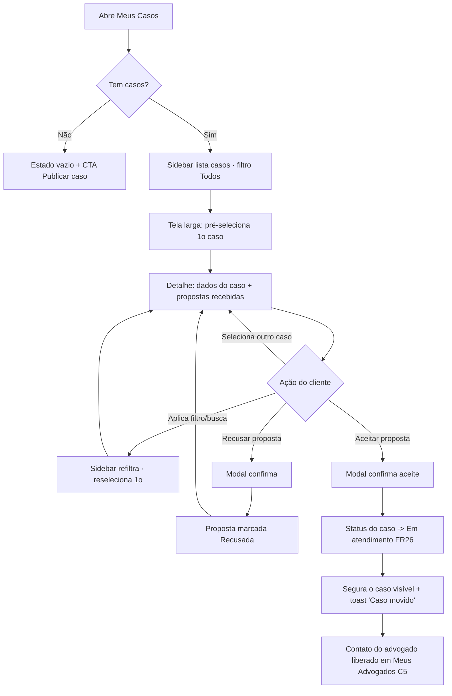
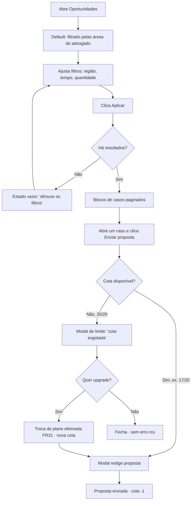
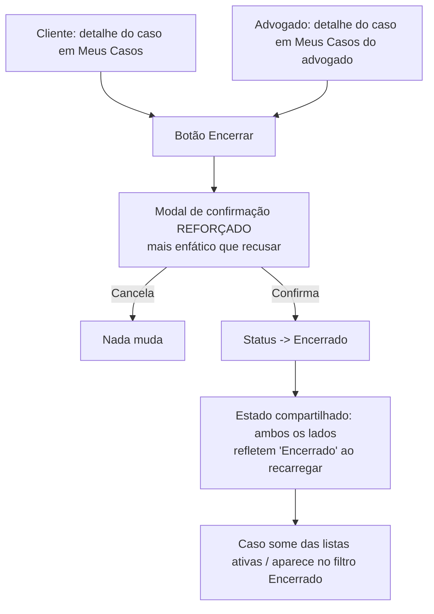

# UX Design Specification - Ponte Jurídica

**Author:** Rafael Mattiuzzo
**Date:** 2026-06-12

---

<!-- UX design content will be appended sequentially through collaborative workflow steps -->

## Executive Summary

### Project Vision
Profissionalizar a experiência do marketplace jurídico Ponte Jurídica dando aos usuários senso de controle e confiança: o cliente compara propostas e escolhe advogados com informação real; o advogado encontra oportunidades relevantes e gere seus casos. Evolução incremental (web, desktop-first) sobre produto funcional — sem reescrita.

### Target Users
- **Cliente** (leigo, pouco técnico): publica casos e escolhe advogados; valoriza clareza e privacidade dos próprios dados.
- **Advogado** (profissional, operacional): busca oportunidades por área/região/recência, gere casos e clientes, e lida com cota de propostas por plano.

**Assimetria de densidade (guia todas as decisões seguintes):** os dois perfis têm densidades opostas. O **cliente** é *baixa frequência, alta ansiedade* — usa pouco, mas está decidindo algo importante; para ele o filtro é **tranquilizador** ("me ajuda a escolher certo"), e o tom visual deve ser calmo e orientador. O **advogado** é *alta frequência, baixa cerimônia* — entra com frequência e quer eficiência; para ele o filtro é **ferramenta** ("me dá volume rápido"), e o tom visual deve ser denso e produtivo.

### Experiência Central
O **master-detail de "Meus Casos" do cliente (C2)** é a experiência central deste lote — não apenas um desafio. É o momento em que o cliente ansioso, vendo as propostas lado a lado com o caso, *sente* que está no controle; é o que mais vende o produto na demonstração. Todas as demais telas orbitam essa peça.

### Key Design Challenges
1. Master-detail de "Meus Casos" (cliente) fiel ao mockup, preservando seleção após mutações — com comportamento responsivo (estado largo e estreito) desenhado JUNTO do layout, não depois (~900px a sidebar empilha no topo).
2. Acomodar muitos filtros (cliente e advogado) sem poluição visual — respeitando a assimetria de densidade.
3. Comunicar privacidade (público vs. privado, cadeado) de forma que gere confiança.
4. Padrão único de Modal para confirmações (C3) e upsell de cota (A2).

### Design Opportunities
- Master-detail fiel ao mockup como destaque visual imediato.
- Cota discreta → modal de upgrade: transforma limite em conversão elegante.
- Estados vazios inteligentes nos filtros (orientam o usuário em vez de só "sem resultados").

## Core User Experience

### Defining Experience
Dois loops centrais, um por perfil:
- **Cliente — comparar e decidir:** abrir um caso → ver as propostas recebidas lado a lado com o caso → aceitar/recusar. O master-detail (C2) É esse loop materializado.
- **Advogado — encontrar e responder:** filtrar oportunidades relevantes (área/região/recência) → abrir o caso → enviar proposta respeitando a cota. Gestão ("Meus Casos", clientes) é o suporte.

### Platform Strategy
- Web SPA, **desktop-first**, interação mouse/teclado. Sem offline, sem touch primário.
- Degrada de forma utilizável até ~tablet; master-detail empilha abaixo de ~900px.
- Mobile dedicado é o app Expo (fora do escopo desta rodada).

### Effortless Interactions
- **Selecionar caso → ver propostas** deve ser instantâneo (sem reload, seleção preservada após aceitar/recusar).
- **Filtrar** reflete rápido; busca textual com debounce, selects/chips reativos imediatos.
- **Aceitar proposta** muda o status do caso automaticamente — usuário não precisa "atualizar" nada.
- **Cota** sempre visível e discreta; o upgrade abre num clique, sem sair da tela.

### Critical Success Moments
- **Cliente:** o instante em que vê duas propostas comparáveis no detalhe e sente que controla a escolha.
- **Cliente:** ver o cadeado nos dados privados e confiar que não vazam.
- **Advogado:** o filtro de região/área retornar oportunidades certas (não uma lista genérica).
- **Advogado:** bater na cota e encontrar o upgrade ali, sem fricção nem erro cru.
- **Quebra-experiência a evitar:** perder a seleção do caso ao aceitar proposta; filtro que devolve vazio sem orientação.

### Experience Principles
1. **Contexto sempre visível** — o cliente nunca perde de vista o caso enquanto avalia propostas (master-detail, não navegação para outra página).
2. **Filtro coerente com a densidade do perfil** — para o **cliente**, filtro reativo e leve (com **debounce** na busca textual); para o **advogado**, conjuntos de filtros compostos (área + região + tempo + quantidade) podem usar um **botão "Aplicar"** explícito, evitando a sensação de "tela piscando" a cada toque.
3. **Defaults inteligentes** — a tela nunca começa em branco esperando input: o **advogado** abre *Oportunidades* já filtrado nas áreas em que atua; o **cliente** abre *Meus Casos* em "Todos".
4. **Confiança visível** — privacidade comunicada (cadeado, rótulos), não só implementada.
5. **Sem becos sem saída** — todo estado vazio orienta o próximo passo; todo limite (cota) oferece caminho.
6. **Mudou, refletiu** — ações (aceitar, encerrar, trocar plano) atualizam a tela sem recarga manual.

> **Nota técnica de interação:** busca textual (CPF/nome em Meus Clientes, Buscar Advogado) usa debounce + cancelamento da requisição anterior, evitando respostas fora de ordem.

## Desired Emotional Response

### Primary Emotional Goals
- **Cliente → Confiança e alívio.** Sair de "estou perdido com isso" para "estou no controle e escolhi bem". A emoção que faz indicar a um amigo: "consegui resolver sem medo de ser enganado".
- **Advogado → Competência e eficiência.** Sentir que a ferramenta respeita o tempo dele: acha oportunidade certa rápido, gere casos sem atrito. "Funciona como eu trabalho."

### Emotional Journey Mapping
- **Descoberta (cliente):** curiosidade sem intimidação — a tela não assusta um leigo.
- **Ação central (cliente):** controle — propostas comparáveis lado a lado, decisão informada.
- **Pós-ação (cliente):** segurança — "aceitei, e meus dados privados estão protegidos" (cadeado).
- **Descoberta (advogado):** reconhecimento — já vê as áreas dele (default inteligente), não uma lista genérica.
- **Ação central (advogado):** fluidez — filtra, abre, propõe sem fricção.
- **Erro/limite:** nunca humilhação. Cota esgotada ou filtro vazio = orientação calma, com saída ("faça upgrade", "afrouxe a nota"), jamais um alerta cru.
- **Retorno:** familiaridade — defaults e seleção lembrados; a tela "continua de onde parou".

### Micro-Emotions
- **Críticas a conquistar:** Confiança (vs. confusão), Trust (vs. ceticismo) — sobretudo na privacidade.
- **Accomplishment** ao aceitar uma proposta / fechar um caso.
- **A evitar:** Ansiedade (excesso de filtros sem orientação), Frustração (perder seleção, erro cru), Ceticismo (dado privado parecer exposto).

### Design Implications
- **Confiança (cliente)** → cadeado + microcópia clara nos dados privados; linguagem sem juridiquês.
- **Controle (cliente)** → master-detail mantém o caso à vista; nada de "página de propostas" separada.
- **Eficiência (advogado)** → defaults inteligentes, densidade de informação, botão "Aplicar" nos filtros compostos.
- **Sem humilhação no erro** → modais de limite/erro com tom de ajuda e um próximo passo, nunca `alert()`.
- **Brilho concentrado, não espalhado** → o capricho visual se concentra na experiência central (C2): skeleton loader em vez de spinner, transição suave (~150ms) ao trocar o detalhe, estado vazio ilustrado com frase humana. O resto das telas permanece limpo e sério. **Estes toques são polimento não-bloqueante** — não atrasam a entrega da Onda 1.

### Emotional Design Principles
1. **Sobriedade que tranquiliza** — estética séria e limpa = confiança visual (espaçamento generoso, tipografia clara, cor de destaque com parcimônia); contexto jurídico pede credibilidade, não diversão. Sóbrio ≠ sem graça: o "wow" vem da fluidez e do acabamento, não de animação chamativa.
2. **Toda fricção tem mão estendida** — limites e vazios sempre oferecem o próximo passo.
3. **Privacidade que se sente** — segurança comunicada visivelmente, gerando trust.
4. **Respeito ao tempo** — para o advogado, cada clique economizado é uma emoção positiva.
5. **Brilho onde a banca olha** — concentrar o capricho técnico no C2 (peça mais demonstrada), mantendo o restante sóbrio; polimento não-bloqueante.

## UX Pattern Analysis & Inspiration

### Inspiring Products Analysis
- **Gmail / clientes de e-mail (master-detail):** lista à esquerda, conteúdo à direita, seleção preservada. É literalmente o padrão do C2. Lição: o item selecionado fica destacado, o detalhe troca sem reload, e ações (arquivar/responder) não tiram você da lista.
- **GetNinjas / 99Freelas / Workana (marketplaces de serviço BR, two-sided):** cliente publica pedido, profissionais enviam propostas, cliente compara. Lição: card de proposta mostra o essencial (quem, quanto, pitch curto) com CTA claro de aceitar; reputação visível na decisão.
- **Airbnb / Booking (filtros densos):** muitos filtros sem intimidar — chips para os comuns, "mais filtros" para o resto, contador de resultados ao vivo. Lição direta para Buscar Advogado (C4) e Oportunidades (A3).
- **LinkedIn (perfil profissional + privacidade):** perfil rico com controle de visibilidade por campo. Lição para C6/A6: separar claramente o que é público do que é privado, com microcópia.

### Transferable UX Patterns
- **Navegação:** master-detail de e-mail → Meus Casos do cliente (C2). Lista preserva seleção, detalhe troca in-place.
- **Interação:** card de proposta estilo marketplace → propostas recebidas (quem/OAB/valor/pitch + Aceitar/Recusar).
- **Filtro:** chips para filtros frequentes + selects para os compostos; contador de resultados ao vivo.
- **Visual:** badges de status (aberto/em atendimento/encerrado) com cor consistente; reputação como estrelas/nota discreta.
- **Privacidade:** rótulo "público/privado" por campo no perfil, à la LinkedIn, com cadeado.

### Anti-Patterns to Avoid
- **window.confirm()/alert() do navegador** — quebra a estética e a confiança (é o que estamos eliminando, C3).
- **Painel de filtros gigante sempre aberto** — intimida o cliente leigo; usar progressive disclosure.
- **Navegar para outra página ao ver propostas** — perde o contexto do caso (mata o controle que queremos no cliente).
- **Lista genérica no primeiro acesso do advogado** — sem default inteligente, ele se sente perdido num mar de casos.
- **Estado vazio mudo** ("Nenhum resultado") sem orientar o próximo passo.
- **Spinner genérico** em vez de skeleton no C2 (perde o "brilho concentrado").

### Design Inspiration Strategy
**Adotar:** master-detail de e-mail (C2); card de proposta de marketplace; badges de status coloridos.
**Adaptar:** filtros do Airbnb simplificados (chips + selects, sem o exagero); controle de privacidade do LinkedIn reduzido a público/privado com cadeado.
**Evitar:** diálogos nativos do navegador (window.confirm/alert), painel de filtro intimidador, perda de contexto, estados vazios mudos.

## Design System Foundation

### Design System Choice
**Abordagem 3 — Sistema temável: Tailwind CSS v4 (já em uso) + camada fina de componentes próprios.** Nenhuma biblioteca de UI nova. Reaproveita os design tokens já definidos em `@theme` do projeto.

### Rationale for Selection
- **Brownfield:** o app já roda Tailwind v4 com tokens de marca (`--color-primary` navy #1a3a5c, `--color-primary-light` #2d5a8e, `--color-secondary` dourado #c9a84c). Trocar de sistema seria retrabalho sem ganho e quebraria a consistência com as telas existentes.
- **Identidade já alinhada ao mockup:** navy + dourado do `Meus casos.png` = os tokens atuais.
- **Sem dependência nova pesada:** evita Material/MUI/Ant (que imporiam visual próprio e bundle).
- **Equipe pequena (MBA):** Tailwind já é conhecido pelo time; curva zero.

### Implementation Approach
- **Tokens:** manter e estender o bloco `@theme` existente (cores de status: aberto/azul, em_atendimento/verde, encerrado/cinza; nota/dourado). Centralizar para não repetir hex espalhado.
- **Acessibilidade do Modal sem dependência:** usar o elemento nativo **`<dialog>`** do HTML como primitiva — ganha foco preso, Esc e backdrop "de graça", atendendo NFR9 sem instalar Radix/Headless UI. Decisão técnica unânime da equipe (usar a plataforma nativa em vez de adicionar lib).
- **Camada fina de componentes próprios**, estilizados só com Tailwind.

### Customization Strategy
Componentes próprios a criar/padronizar (todos com Tailwind + tokens):
- `<Modal>` — **encapsula o `<dialog>` nativo num único componente React** (não espalhar `showModal()` pelas telas; troca de primitiva fica em 1 arquivo — inegociável). Inclui **transição suave de abertura via `@starting-style`** (Tailwind v4) para não "piscar", coerente com o tom sóbrio-com-acabamento. Base de confirmações (C3) e do modal de cota (A2).
- `<FilterChips>` e `<FilterBar>` — chips + selects reativos/aplicar conforme o perfil.
- `<StatusBadge>` — badge de status do caso, cor por estado (token único).
- `<RatingStars>` — nota do advogado (dourado), read-only nesta rodada.
- `<EmptyState>` — estado vazio com ilustração/ícone + frase humana + CTA.
- `<Avatar>` / upload de foto — foto de perfil com fallback de iniciais.
- `<Skeleton>` — placeholder de carregamento (brilho concentrado no C2).
- `<Toast>` — aviso transitório de mudança de estado (ex.: "caso movido para Em atendimento").

## 2. Core User Experience

### 2.1 Defining Experience
**"Selecionar um caso e comparar as propostas recebidas lado a lado, sem nunca perder o caso de vista."** Se descrita a um amigo: "eu vejo meu caso e, do lado, todas as propostas dos advogados — comparo e aceito a melhor." É o master-detail de Meus Casos (C2): sidebar de casos à esquerda, detalhe com propostas à direita.

### 2.2 User Mental Model
- O cliente já conhece esse padrão de e-mail (lista → conteúdo) e de marketplaces (pedido → respostas).
- Expectativa: clicar num item à esquerda muda o painel à direita, sem "ir para outra página".
- Ponto de confusão a evitar: o rótulo do mockup "Propostas enviadas" sugere que a sidebar lista propostas — mas ela lista CASOS (cada um com contagem de propostas recebidas). A UI deve deixar isso óbvio (ex.: "Meus casos" como título da coluna, contagem de propostas como sub-rótulo do item).

### 2.3 Success Criteria
- Clicar num caso troca o detalhe em < 150ms, sem reload e sem piscar a página.
- O caso selecionado permanece destacado na sidebar.
- Após aceitar/recusar uma proposta, a lista e o detalhe atualizam, mas **o caso continua visível no detalhe** — mesmo que a mudança de status o tire do filtro ativo (ver mecânica de "segurar o caso" em 2.5).
- O cliente entende, sem instrução, que a coluna esquerda são os casos dele e a direita são as propostas.
- Filtros do topo (tipo/status/valor) afetam a sidebar; em telas largas o caso pré-selecionado é o primeiro da lista filtrada.

### 2.4 Novel UX Patterns
**Estabelecido, não novo.** É master-detail clássico (e-mail) + cards de proposta (marketplace) — zero curva de aprendizado. O "twist" é só o contexto jurídico e o polimento (skeleton, transição). Não há padrão novo a ensinar; usamos metáforas que o usuário já domina.

### 2.5 Experience Mechanics
**1. Initiation:**
- Cliente abre *Meus Casos* (rota inicial do cliente). Default: filtro "Todos".
- Sidebar à esquerda lista os casos (título, badge de status, contagem "N propostas").
- **Pré-seleção (telas largas):** o detalhe abre já com `casosFiltrados[0]` selecionado — preenche o painel e mostra a feature de cara, evitando o vazio "selecione um caso". Recalculado quando o filtro muda. Em **telas estreitas (~900px) não há pré-seleção** — o usuário escolhe e o detalhe expande (senão cairia direto no detalhe sem ver a lista). Se o filtro zera a lista, painel vazio com orientação.

**2. Interaction:**
- Clica num caso → o painel direito carrega (skeleton) e mostra: dados do caso + lista de propostas recebidas (card: nome, OAB, área, valor, pitch + Aceitar/Recusar).
- Filtros do topo (chips de status + select de tipo + ordenar por valor) reordenam/filtram a sidebar reativamente; busca textual ("Buscar caso...") com debounce.
- Responsivo: < ~900px a sidebar vira lista no topo (empilha); selecionar um caso rola/expande o detalhe.

**3. Feedback:**
- Caso selecionado destacado (fundo/realce com token). Skeleton enquanto carrega o detalhe.
- Aceitar abre `<Modal>` de confirmação; ao confirmar, status do caso vira "em atendimento" (FR26), o badge muda e a proposta aceita é marcada.
- **Caso-limite (mudança de status tira o caso do filtro):** o detalhe **segura o caso recém-mutado visível** (já com o novo status) até a próxima interação do cliente, em vez de virar "fantasma" selecionado fora da lista ou fazer a lista pular. Um **toast "Caso movido para Em atendimento"** explica a mudança. Continuidade acima da pureza do filtro.
- Estado vazio: "Você ainda não publicou casos" (com CTA publicar) ou "Nenhuma proposta ainda neste caso".

**4. Completion:**
- O cliente aceitou uma proposta: caso em atendimento, contato do advogado disponível em Meus Advogados (C5). Próximo passo claro, sem o cliente precisar atualizar nada.

## Visual Design Foundation

### Color System
**Base existente (manter — extraída de `web/src/index.css`):**
- `--color-primary` #1a3a5c (navy) — identidade, headers, ações primárias.
- `--color-primary-light` #2d5a8e — hover/estados de primary.
- `--color-secondary` #c9a84c (dourado) — destaque/valor, reputação (nota), CTA de conversão.
- Fundo app #f8fafc; texto base #0f172a.

**A adicionar (semânticas que o lote exige — centralizar no `@theme`):**
- **Status do caso:** `aberto` → azul (#2563eb/blue-600); `em_atendimento` → verde (#059669/emerald-600); `encerrado` → cinza (#64748b/slate-500).
- **Feedback:** sucesso (verde), aviso (âmbar), erro (#dc2626/red-600) — para toasts, validação de upload e estados de limite.
- **Privacidade:** cadeado usa cinza-neutro + ícone; não inventa cor nova, sinaliza com ícone + microcópia.
- **Nota/reputação:** estrelas em dourado (secondary), trilho em slate-200.

**Acessibilidade de cor:** navy #1a3a5c sobre branco e branco sobre navy passam AA. Dourado #c9a84c **não** tem contraste AA para texto pequeno sobre branco → usar dourado só para realce/ícones/valores grandes, **nunca para texto pequeno em corpo**. (Regra registrada para evitar erro recorrente.)

### Typography System
- **Família única: Inter** (já carregada) — moderna, neutra, alta legibilidade em telas densas. Sem fonte serifada (evita ar "cartório antigo"; queremos credibilidade moderna).
- **Escala (Tailwind):** h1 ~text-2xl/3xl bold; h2 ~text-xl semibold; corpo text-sm/base; meta/labels text-xs uppercase tracking-wide (rótulos de seção, como "PROPOSTAS RECEBIDAS" no mockup).
- **Hierarquia por peso + cor**, não só tamanho — título slate-800 bold, meta slate-400. Coerente com as telas atuais.

### Spacing & Layout Foundation
- **Base 4px** (escala padrão do Tailwind) — já é o que o projeto usa.
- **Densidade por perfil:** telas do cliente mais arejadas (cards p-6, rounded-2xl como hoje); telas do advogado um pouco mais densas (listas/blocos p-4), respeitando a assimetria.
- **Layout master-detail (C2):** grid de 2 colunas (sidebar fixa ~320px + detalhe fluido) em ≥900px; empilha em coluna única abaixo disso.
- **Container:** max-w-6xl centralizado, como nas telas atuais — manter consistência.

### Accessibility Considerations
- Contraste AA para texto; dourado restrito a realce (regra acima).
- Foco visível em todos os interativos (outline com token; já há `--accent` no App.css).
- Modais (`<dialog>`) com foco preso/Esc (NFR9); ícone de status sempre acompanhado de texto (não depender só de cor — daltônicos).
- Tamanho mínimo de alvo ~40px nos controles de filtro (vale também no tablet).

## Design Direction Decision

### Design Directions Explored
Projeto brownfield com linguagem visual estabelecida (navy #1a3a5c + dourado #c9a84c, Inter, cards rounded-2xl, container max-w-6xl) e um mockup aprovado da tela central (`Meus casos.png`). Não se justifica explorar direções visuais divergentes — quebraria a consistência com as telas existentes. A exploração se concentra em variações de DENSIDADE e DISPOSIÇÃO dentro da mesma linguagem, não em temas alternativos.

**Artefato gerado:** `docs/bmad/ux-design-directions.html` — protótipo estático navegável com 5 telas-chave (C2 master-detail, Oportunidades em blocos, Minha Conta cliente, Perfil advogado com áreas, Modal de cota) usando os tokens reais. Referência viva para o time de front e apoio de demonstração.

### Chosen Direction
**"Continuidade + Fidelidade ao Mockup"** — estender a linguagem visual atual, materializando o layout do `Meus casos.png`:
- Hero/header navy com título e ação primária (como nas telas atuais).
- Master-detail: sidebar escura (navy) à esquerda com busca + lista de casos; detalhe claro à direita com cards de proposta — exatamente o mockup.
- Cards brancos rounded-2xl, badges de status coloridos, valor/nota em dourado.
- Filtros como chips (status) + selects (tipo/ordenar) no topo.

### Design Rationale
- **Consistência:** o usuário não percebe "duas eras" de design no mesmo app.
- **Fidelidade:** o mockup já é o alvo aprovado pela equipe; replicá-lo reduz risco e retrabalho.
- **Esforço:** reaproveita componentes e tokens; foco vai para a lógica (filtros, master-detail), não para reinventar estética.
- **Banca:** o contraste sidebar-escura/detalhe-claro do mockup é visualmente forte e "vende" sozinho.

### Implementation Approach
- Aplicar tokens existentes + os novos (status/feedback) da Visual Foundation.
- A tela C2 é a referência-mestra; demais telas herdam o mesmo vocabulário (cards, badges, chips, modais).
- O HTML de direções serve de espelho visual; o React implementa a lógica por trás.

## User Journey Flows

### Fluxo 1 — Cliente: comparar e aceitar proposta (C2)
Entrada: cliente abre *Meus Casos*. Cobre seleção, filtro, aceitar e o caso-limite de status.

### Fluxo 2 — Advogado: achar oportunidade e propor, com cota (A2/A3/A4)
Entrada: advogado abre *Oportunidades* (default nas áreas dele). Cobre filtro, proposta e cota esgotada → upgrade.

### Fluxo 3 — Encerrar caso (FR27 · ambos podem)
Tanto o cliente (dono) quanto o advogado responsável encerram, a partir do **detalhe do caso** (ação contextual, não solta na lista). Estado "encerrado" é compartilhado e reflete nos dois lados ao recarregar (sem notificação push nesta rodada).

### Journey Patterns
- **Navegação:** master-detail (cliente) e lista-em-blocos→detalhe (advogado); nunca tela cheia de loading — skeleton no lugar.
- **Decisão:** toda ação destrutiva/irreversível (aceitar, recusar, encerrar) passa por `<Modal>` de confirmação; **encerrar usa modal reforçado** (mais enfático que recusar — encerra um caso ativo).
- **Ação contextual:** ações sobre um caso (aceitar, recusar, encerrar) vivem no **detalhe**, não soltas em listas/menus.
- **Feedback:** mutação → atualização in-place + toast quando o item muda de categoria/filtro.
- **Estado compartilhado:** transições de status (em atendimento, encerrado) refletem nos dois lados (cliente e advogado) ao recarregar.
- **Recuperação:** todo vazio e todo limite oferecem o próximo passo (CTA), nunca beco sem saída.
- **Default inteligente:** a tela abre com o filtro mais útil já aplicado (cliente "Todos", advogado "minhas áreas").

### Flow Optimization Principles
- **Mínimo de passos ao valor:** cliente vê propostas sem navegar para outra página; advogado já chega filtrado.
- **Carga cognitiva baixa:** filtros progressivos (chips comuns visíveis, compostos em selects).
- **Continuidade > pureza:** após mutação, mantém contexto (caso segurado + toast) em vez de "resetar" a tela.
- **Erro sem humilhação:** limite de cota é uma oferta de upgrade, não um alerta de falha.

## Component Strategy

### Design System Components
Nenhuma biblioteca de UI — base = Tailwind v4 (tokens) + primitivas nativas do browser (`<dialog>`, `<input type=file>`, `<select>`). Todos os componentes abaixo são próprios.

### Custom Components

#### `<Modal>` (fundação — Onda 0)
- **Propósito:** confirmações (C3) e diálogos ricos (cota A2, encerrar caso, prévia de upload).
- **Anatomia:** `<dialog>` + backdrop + header (título) + corpo (slot) + footer (ações).
- **Estados:** fechado / abrindo (transição `@starting-style`) / aberto / fechando.
- **Variantes:** `confirm` (sim/não), `reforçado` (encerrar — destaque de aviso), `rico` (conteúdo livre: cota, proposta).
- **A11y (NFR9):** `showModal()` (foco preso nativo), Esc fecha, foco retorna ao gatilho, `aria-labelledby`.

#### `<FormField>` (fundação — Onda 0)
- **Propósito:** campo de formulário padrão (label + input/control + mensagem de erro + hint). Base dos formulários de perfil (C6/A6) e de redigir proposta; centraliza a exibição de erro (inclui erro de upload, NFR5).
- **Estados:** default / focus / erro (mensagem + borda) / disabled / com hint.
- **Variantes:** texto, select, file, e **`PrivacyField`** (variante com cadeado + microcópia público/privado — C6/A6).
- **A11y:** `<label>` associado, `aria-invalid` + `aria-describedby` para erro.

#### `<FilterBar>` + `<FilterChips>` (Onda 2)
- **Propósito:** filtros de listagens (C1/C4/A3/A4/A5).
- **Anatomia:** linha de chips (status) + selects (tipo/região/ordenar) + campo de busca + (advogado) botão "Aplicar".
- **Estados:** chip on/off, select aberto, busca com debounce, "aplicando" (loading).
- **Variantes:** `reativo` (cliente, sem Aplicar) vs. `aplicar` (advogado, conjuntos compostos).
- **A11y:** chips como `role=button`/`aria-pressed`; busca com `<label>`; alvo ≥40px.

#### `<Pagination>` (Onda 2)
- **Propósito:** paginação numerada das listagens (anterior/próximo + página atual), alinhada ao envelope `{data,total,page,pageSize}` e ao seletor de quantidade 20/30/50/100 (A4).
- **Decisão:** **paginação clássica numerada — NÃO scroll infinito** (coerente com "exibir N por página" e com o backend page/pageSize).
- **Regra de UI:** **oculta quando há só 1 página** (não exibir "Página 1 de 1" — ruído).
- **A11y:** botões com `aria-label`, página atual com `aria-current=page`.

#### `<StatusBadge>` (Onda 1)
- **Propósito:** status do caso (aberto/em atendimento/encerrado); uma cor de token por status; **ícone + texto** (não só cor — daltônicos).

#### `<RatingStars>` (Onda 0/2)
- **Propósito:** nota do advogado (seedada). **Read-only** nesta rodada. `aria-label="Nota 4,8 de 5"`.

#### `<CaseListItem>` + `<ProposalCard>` (Onda 1 — coração do C2)
- **CaseListItem:** item da sidebar (título, status badge, contagem de propostas); estados selected/hover; `aria-current` na seleção.
- **ProposalCard:** card de proposta (nome, OAB, área, ⭐, valor em dourado, pitch) + ações Aceitar/Recusar.

#### `<EmptyState>` (Onda 1)
- **Propósito:** estados vazios orientadores (sem casos, sem propostas, filtro sem resultado): ícone + frase humana + CTA.

#### `<Avatar>` + `<FileUpload>` (Onda 0/3)
- **Avatar:** foto com fallback de iniciais.
- **FileUpload:** seleção de foto/documento; valida tipo (jpg/png/pdf) e tamanho (5MB) com **erro via `<FormField>`/modal** (NFR5); indica privacidade (cadeado) para documento.

#### `<Toast>` (Onda 1)
- **Propósito:** aviso transitório de mudança de estado ("Caso movido para Em atendimento"). `role=status`/`aria-live=polite`; auto-dismiss + dismiss manual.

#### `<Skeleton>` (Onda 1 — polimento não-bloqueante)
- **Propósito:** placeholder de carregamento no detalhe do C2 (brilho concentrado).

### Component Implementation Strategy
- Todos sobre Tailwind + tokens; zero dependência nova.
- `<Modal>` encapsula `<dialog>` num único arquivo (troca de primitiva = 1 lugar).
- Componentes "burros" (apresentação) recebem dados via props; lógica de filtro/paginação fica num hook compartilhado (envelope `{data,total,page,pageSize}`).
- Formulários padronizados via `<FormField>` (erro consistente, inclusive upload).

### Implementation Roadmap (alinhado às Ondas do PRD)
- **Onda 0 (fundação):** `<Modal>`, `<FormField>`, `<FileUpload>`/`<Avatar>`, hook de filtro/paginação, `<RatingStars>`.
- **Onda 1 (C2 + núcleo):** `<CaseListItem>`, `<ProposalCard>`, `<StatusBadge>`, `<EmptyState>`, `<Toast>`, `<Skeleton>`.
- **Onda 2 (filtros):** `<FilterBar>`/`<FilterChips>` + `<Pagination>` nas 4 telas de listagem.
- **Onda 3 (perfis):** `<PrivacyField>` (variante de FormField), composição de perfil cliente/advogado.

## UX Consistency Patterns

### Button Hierarchy
- **Primária** (navy preenchido): a ação principal da tela/modal — Aceitar, Salvar, Enviar proposta. Uma por contexto.
- **Secundária/ghost** (borda + texto slate): ação alternativa — Recusar, Cancelar, Fechar.
- **Conversão** (dourado): CTAs de valor/conversão — Publicar caso, Trocar/Upgrade de plano.
- **Destrutiva reforçada**: Encerrar caso — visual de aviso, mais enfática que um ghost comum.
- Regra: nunca duas primárias competindo; ação destrutiva nunca como primária navy "normal".

### Feedback Patterns
- **Sucesso / mudança de estado:** `<Toast>` (aria-live polite), auto-dismiss — ex.: "Caso movido para Em atendimento".
- **Erro de ação/validação:** mensagem inline no `<FormField>` (aria-invalid) — nunca `alert()`.
- **Erro/limite de fluxo:** `<Modal>` com tom de ajuda + próximo passo (cota esgotada → upgrade).
- **Confirmação:** `<Modal>` confirm para ações irreversíveis; **reforçado** para encerrar.
- Proibido: `window.confirm()`/`alert()` (NFR14).

### Form Patterns
- Todo campo via `<FormField>` (label + control + erro + hint); validação no submit + inline no blur quando fizer sentido.
- Botão de salvar mostra estado "salvando"; sucesso confirmado por toast.
- Upload: valida tipo/tamanho antes de enviar; erro no `<FormField>`; documento sinaliza privacidade (cadeado).
- Campos privados sempre rotulados com cadeado + microcópia (público vs. privado).

### Navigation Patterns
- Top nav por papel (cliente/advogado), item ativo destacado — manter o padrão já existente.
- Dentro de um caso: **master-detail** (cliente) — selecionar não navega para outra rota, troca o painel.
- Ações sobre um item vivem no **detalhe** (contextuais), não soltas em listas/menus.
- Rotas novas: "Meus Casos" do advogado (A1) entra na nav do advogado.

### Search & Filter Patterns
- **Cliente:** filtros reativos (chips + selects), busca textual com debounce — sem botão "Aplicar".
- **Advogado:** conjuntos compostos com botão **"Aplicar"**; default já filtrado nas áreas dele.
- Contador de resultados visível; **paginação numerada** (oculta com 1 página); sem scroll infinito.
- Filtro sem resultado → `<EmptyState>` orientador, nunca lista "muda".

### Loading & Empty States
- **Loading:** `<Skeleton>` no detalhe do C2 e em listas; nunca spinner genérico no lugar central.
- **Empty:** `<EmptyState>` com frase humana + CTA (sem casos, sem propostas, filtro vazio).

### Modal Pattern
- Um só `<Modal>` (sobre `<dialog>`): foco preso, Esc, backdrop, transição `@starting-style`.
- Variantes: confirm / reforçado / rico (cota, proposta). Título sempre presente (aria-labelledby).

## Responsive Design & Accessibility

### Responsive Strategy
- **Desktop-first** (alvo primário; mockup é desktop). Aproveitar o espaço com master-detail de 2 colunas e densidade de informação no advogado.
- **Tablet:** layouts continuam utilizáveis; master-detail empilha; grids de blocos passam de 2 colunas para 1; alvos de toque ≥40px.
- **Mobile dedicado = app Expo (fora desta rodada).** A web não precisa ser ótima em <600px, mas não pode quebrar — degradação graciosa, não suporte de primeira classe.

### Breakpoint Strategy
- Usar os breakpoints padrão do Tailwind. Pontos-chave deste lote:
  - **~900px (lg/custom):** master-detail (C2) deixa de ser 2 colunas → sidebar empilha no topo, detalhe abaixo. **Sem pré-seleção automática** abaixo desse ponto.
  - **~768px (md):** grids de blocos (Oportunidades A4) de 2→1 coluna; **filtros compostos simplesmente empilham verticalmente (`flex-wrap`)** — sem drawer/acordeão (evita gold-plating numa tela desktop-first; mobile é o app Expo).
- Container max-w-6xl centralizado mantém consistência com as telas atuais.

### Accessibility Strategy
- **Alvo: WCAG AA pragmático** (não AAA, não auditoria formal — coerente com NFR10).
- Contraste AA: navy/branco ok; **dourado restrito a realce, nunca texto pequeno** (regra da Visual Foundation).
- **Teclado:** todos os interativos focáveis; modais com foco preso/Esc (NFR9); ordem de tab lógica.
- **Leitor de tela:** HTML semântico, `aria-current` na seleção do C2, `aria-live` nos toasts, `aria-invalid`/`aria-describedby` nos erros de formulário.
- **Não depender só de cor:** status com ícone + texto (daltônicos).
- Alvos de toque ≥40px nos controles de filtro (vale no tablet).
- **Checklist de a11y por componente no Definition of Done** (vira critério de aceite das stories). Ex.: `<Modal>` → foco preso ✓ / Esc fecha ✓ / foco retorna ao gatilho ✓ / aria-labelledby ✓. `<FilterChips>` → role/aria-pressed ✓ / alvo ≥40px ✓. `<FormField>` → label associado ✓ / aria-invalid no erro ✓.

### Testing Strategy
- **Responsivo:** Chrome DevTools (responsive) nos breakpoints-chave (900/768px) + teste manual em Chrome/Edge/Firefox (matriz evergreen do PRD). Não há matriz de dispositivos físicos nesta rodada.
- **Acessibilidade:** checagem com axe DevTools (automatizado) + navegação só por teclado nos fluxos críticos (C2, modais, formulários) + checklist de a11y por componente. Teste de daltonismo via simulação do DevTools.
- **Demo-readiness:** smoke test dos 3 fluxos (Mermaid) antes de fechar cada onda.
- *Fora de escopo:* teste com usuários reais de tecnologia assistiva (registrado como ideal não atendido).

### Implementation Guidelines
- **Responsivo:** classes utilitárias do Tailwind (mobile-first nos modificadores, mesmo sendo desktop-first no design); evitar larguras fixas em px no master-detail (usar grid + minmax).
- **Acessibilidade:** semântica primeiro (`<button>`, `<nav>`, `<dialog>`, `<label>`); ARIA só onde o HTML não basta; foco visível sempre (outline com token); skip-link opcional no shell.
- **Sem regressão:** as telas existentes não devem perder acessibilidade ao serem refatoradas.
